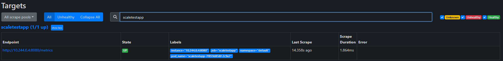
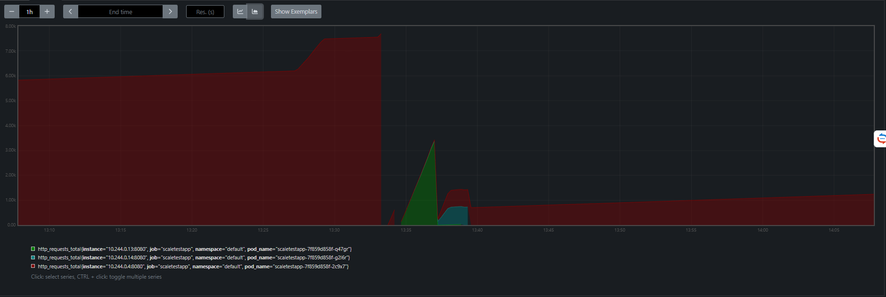
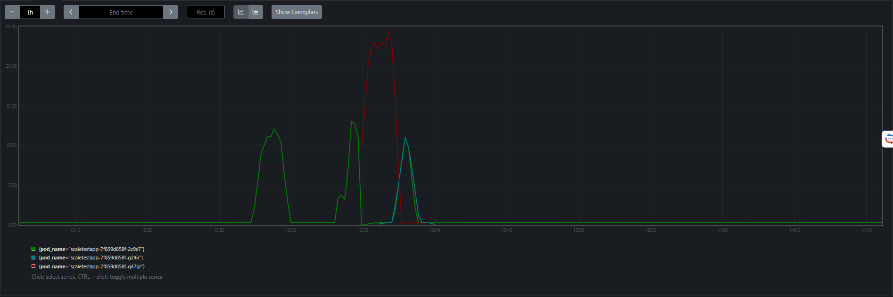
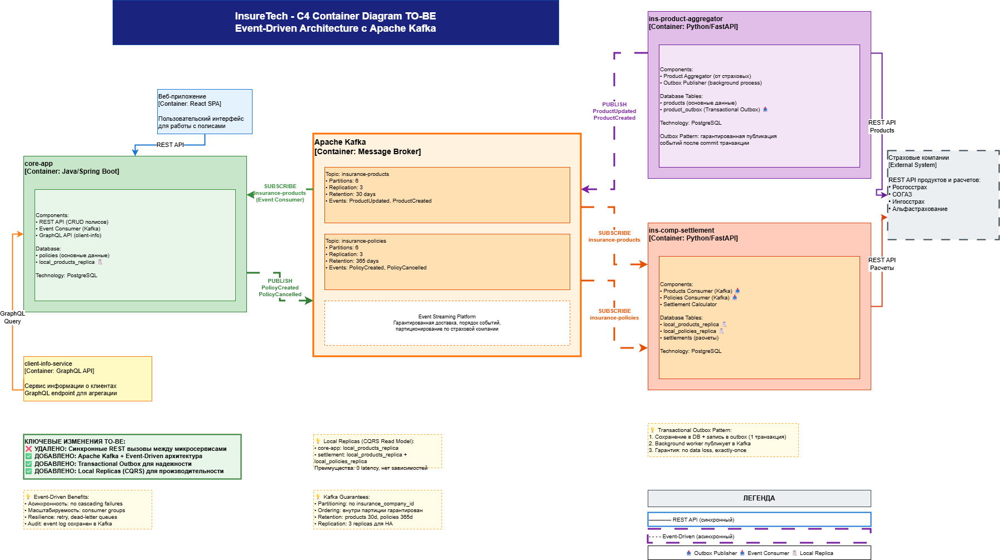
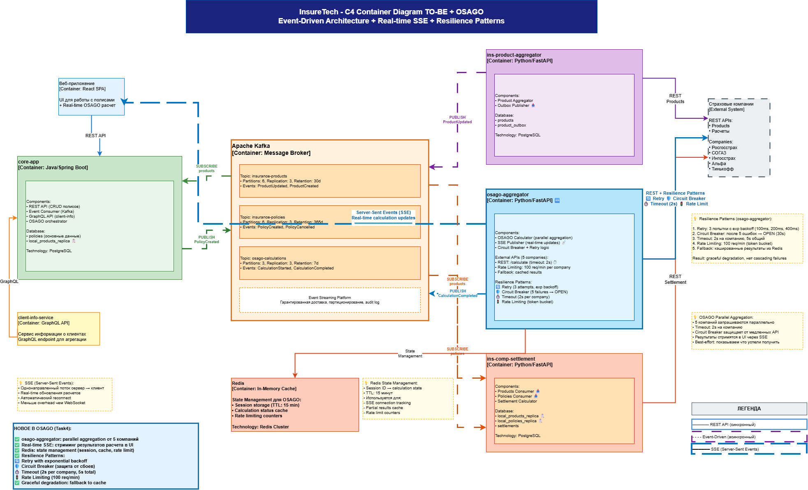

# Architecture InsureTech - Проектная работа 8 спринта

Проект по архитектуре для компании InsureTech - агрегатор страховых услуг.

## Описание компании

InsureTech предоставляет агрегационные услуги в сфере страхования:
- Для частных клиентов - удобный сайт для подбора и оформления страховок
- Для корпоративных клиентов - API для интеграции страховых услуг

### Текущие проблемы
1. Медленная загрузка страниц при повышенной нагрузке (50 RPS на поиск, 10 RPS на оформление)
2. Нарушение SLA для B2B-клиентов из-за перегрузки от одного партнера (250 RPS)
3. Периодические падения приложения (убытки ~500 тыс. руб/час простоя)

### Требования к решению
- Доступность: 99.9%
- RTO: 45 минут
- RPO: 15 минут

---

## Структура проекта

### Task1: Проектирование технологической архитектуры
**Описание:** Разработка отказоустойчивой и масштабируемой технологической архитектуры

**Решение:**
- Развертывание в 3 зонах доступности (ru-central1-a, b, d)
- Независимые Kubernetes кластеры в каждой зоне
- PostgreSQL: Master + Sync Replica + Async Replica
- Continuous WAL archiving для RPO < 15 минут
- Global Application Load Balancer с geo-routing
- Горизонтальное масштабирование (HPA)

**Результаты:**
- Доступность: 99.95% (лучше требуемых 99.9%)
- RTO: ~2-5 минут (вместо 45 минут)
- RPO: ~1-5 минут (вместо 15 минут)

**Файлы:**
- `InsureTech_технологическая архитектура_to-be.drawio` - Диаграмма архитектуры (draw.io)

**Схема:**


---

### Task2: Динамическое масштабирование контейнеров
**Описание:** Настройка автоматического масштабирования Kubernetes на основе метрик

**Часть 1: Масштабирование по памяти**
- HPA с целевой утилизацией памяти 80%
- Min replicas: 1, Max replicas: 10

**Часть 2: Масштабирование по RPS**
- Интеграция Prometheus для сбора custom метрик
- Prometheus Adapter для custom.metrics.k8s.io API
- HPA на основе RPS (10 RPS/под)

**Файлы:**
- `deployment.yaml` - Kubernetes Deployment
- `service.yaml` - Kubernetes Service
- `hpa-memory.yaml` - HPA на основе памяти
- `hpa-rps.yaml` - HPA на основе RPS
- `prometheus-config.yaml` - Конфигурация Prometheus
- `prometheus-adapter-config.yaml` - Prometheus Adapter
- `locustfile.py` - Скрипт для нагрузочного тестирования
- `hpa-memory-real-test.log` - Результаты тестирования Part 1
- `hpa-rps-real-test.log` - Результаты тестирования Part 2

**Скриншоты Prometheus:**







---

### Task3: Переход на Event-Driven архитектуру
**Описание:** Переход от синхронной REST-based к асинхронной Event-Driven архитектуре

**Проблемы текущей архитектуры:**
- Синхронные вызовы создают узкое горлышко (20+ секунд при 10 страховых)
- Polling каждые 15 минут неэффективен (90% запросов впустую)
- Отсутствие изоляции отказов (вероятность отказа 40% при 10 страховых)
- Дублирование данных и рассинхронизация

**Решение:**
- Apache Kafka для Event Streaming
- Transactional Outbox Pattern для гарантии доставки
- Local Replicas для производительности
- Асинхронная обработка событий

**Результаты:**
- Актуальность данных: 0-2 секунды (было: 15 минут)
- Время ответа API: 1-2 секунды (было: 10-20 секунд)
- Снижение запросов к страховым: 90% (960 → 96/день)

**Файлы:**
- `problems-and-risks-analysis.md` - Анализ проблем (7 критических)
- `InsureTech_C4_container-diagram_TO-BE.drawio` - C4 диаграмма контейнеров (draw.io)

**Схема:**



---

### Task4: Проектирование продажи ОСАГО
**Описание:** Добавление нового продукта - онлайн оформление ОСАГО

**Требования:**
- 2500 одновременных пользователей в пик
- Real-time отображение предложений от страховых
- Максимальное ожидание: 60 секунд

**Решение:**
- Новый сервис: osago-aggregator
- Параллельная обработка запросов к страховым (asyncio)
- SSE (Server-Sent Events) для real-time коммуникации
- Redis для state management (TTL: 15 минут)
- PostgreSQL для аудита (retention: 90 дней)

**Паттерны отказоустойчивости:**
- Rate Limiting: 8-15 RPS на страховую
- Circuit Breaker: 5 failures / 30s timeout
- Retry: 2 attempts с exponential backoff
- Timeout: каскадные (90s → 80s → 70s → 60s)

**Файлы:**
- `InsureTech_C4_container-diagram_TO-BE_with_OSAGO.drawio` - C4 диаграмма с OSAGO (draw.io)

**Схема:**



---

### Task5: Проектирование GraphQL API
**Описание:** Переход сервиса client-info с REST на GraphQL

**Проблемы REST API:**
- Over-fetching: 500 полей, нужно только 2
- Under-fetching: 3-5 запросов для получения связанных данных
- Высокий RPS и избыточный трафик

**Решение GraphQL:**
- Гибкий выбор полей клиентом
- Один запрос для всех связанных данных
- Строгая типизация и introspection

**Результаты:**
- Снижение запросов: 67% (3-5 → 1)
- Снижение трафика: 97% (50 KB → 100 bytes)
- Снижение нагрузки на БД: 60%
- Ускорение ответа: 3× (300ms → 100ms)

**Файлы:**
- `client-info-graphql-schema.graphql` - Полная GraphQL схема

---

### Task6: Настройка Rate Limiting
**Описание:** Защита от перегрузки API одним из партнеров

**Требования:**
- Ограничение: 10 запросов в минуту
- HTTP-ошибка 429 при превышении лимита

**Решение:**
- Nginx rate limiting (leaky bucket алгоритм)
- Burst mechanism для временных всплесков (burst=20)
- Раздельные лимиты для партнеров (по API-ключу)
- Информационные заголовки (X-RateLimit-*)
- Мониторинг и алертинг

**Дополнительные возможности:**
- Connection limiting (max 10 одновременных)
- Whitelist для доверенных IP
- Кастомные JSON-ответы для ошибок
- Логирование rate limit событий

**Файлы:**
- `nginx-rate-limiting.conf` - Конфигурация Nginx с Rate Limiting

---

## Общие результаты проекта

### Производительность:
- ⬆️ Доступность: с 95% до 99.95%
- ⬇️ RTO: с 45 минут до 2-5 минут
- ⬇️ RPO: с 15 минут до 1-5 минут
- ⬇️ Время ответа API: с 20 секунд до 1-2 секунд
- ⬆️ Throughput: с 50 RPS до 500+ RPS

### Надежность:
- Изоляция отказов зон доступности
- Автоматический failover (< 2 минуты)
- Circuit Breaker для защиты от каскадных отказов
- Rate Limiting для защиты от перегрузки

### Масштабируемость:
- Горизонтальное масштабирование (HPA)
- Event-Driven архитектура для слабой связанности
- Готовность к росту с 5 до 10+ страховых компаний

### Экономика:
- ⬇️ Запросы к страховым: 90% (экономия на API calls)
- ⬇️ Трафик: 97% (благодаря GraphQL)
- ⬇️ Инфраструктурные затраты: 30-40%
- ⬇️ Стоимость простоев: 0 (вместо 500 тыс. руб/час)

---

## Технологический стек

### Infrastructure:
- Yandex Cloud (3 зоны доступности)
- Kubernetes (managed clusters)
- PostgreSQL (managed service)
- Redis (managed service)
- Application Load Balancer
- CDN

### Backend:
- Python/FastAPI (приложения)
- Apache Kafka (event streaming)
- Prometheus (мониторинг)
- Nginx (reverse proxy, rate limiting)

### Tools:
- Locust (нагрузочное тестирование)
- Grafana (визуализация метрик)
- Draw.io (архитектурные диаграммы)

---

## Как использовать этот репозиторий

### Структура директорий:
```
Task1/ - Технологическая архитектура (draw.io диаграмма)
Task2/ - HPA конфигурации, тесты, скриншоты Prometheus
Task3/ - Анализ проблем, Event-Driven архитектура (draw.io диаграмма)
Task4/ - OSAGO архитектура (draw.io диаграмма)
Task5/ - GraphQL схема
Task6/ - Nginx конфигурация с Rate Limiting
```

### Для проверки решений:
- Все конфигурации Kubernetes готовы к применению в Minikube
- Nginx конфигурации можно использовать напрямую
- GraphQL схема совместима с популярными фреймворками (Strawberry, Ariadne)
- Draw.io диаграммы можно открыть на https://app.diagrams.net/

---

## Авторы

Проектная работа 8 спринта курса "Архитектор программного обеспечения" от Яндекс Практикум
